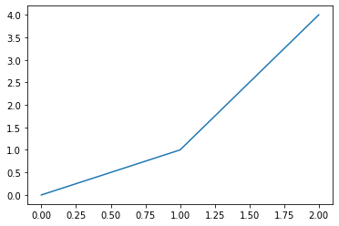
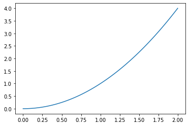
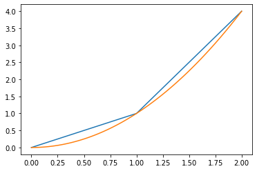
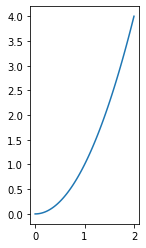
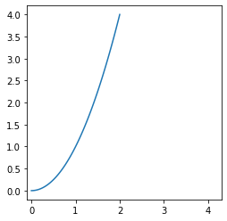
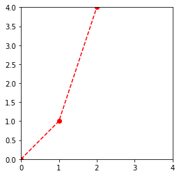
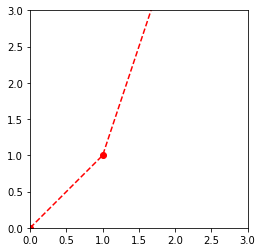

### 2.1. Instalasi program
Coming soon
### 2.2. Dasar-Dasar Python
Coming soon
### 2.3. Dasar-Dasar Jupyter Norebook
Coming soon


### 2.4. Menggambar Grafik
Untuk membuat grafik, kita membutuhkan module *matplotlib*. Beberapa library yang cukup membantu dalam membuat grafik adalah:
- matplotlib
- numpy
- math

Modul matplotlib digunakan untuk menggambar grafik, numpy digunakan untuk menympan data, operasi matematika, dll., sedangkan math adalah modul bawaan python yang digunakan untuk operasi matematika.

Untuk mengimport modul-modul di atas bisa digunakan kode-kode berikut ini:


```python
# Meng-import pustaka menggunakan dua cara
import matplotlib.pyplot as plt
import numpy as np
import math
```

#### 2.4.1 Membuat titik-titik sampel
Cara pertama dan kedua


```python
# Cara pertama membuat list
x1 = [0, 1, 2]
y1 = [0,1, 4] 

# Cara kedua membuat list
x2 = []
dx2 = 2/100
for i in range(101):
    x2.append(i*dx2) 
y2 = []
for i in x2:
    y2.append(i**2) 
```

Cara ketiga


```python
# Cara ketiga: List Comprehensive
dx = 2/100
x3 = [i*dx for i in range(101)]
y3 = [i**2 for i in x3]
 
```

Cara keempat


```python
# Cara ketiga: Numpy in Action 
x4 = np.linspace(0,2,101)
y4 = x4**2
 
```

#### 2.4.2 Plotting grafik

Plot kurva persamaan kuadrat menggunakan tiga titik sampel [x1, y1]


```python
# Plotting grafik
fig, ax = plt.subplots() # membuat objek gambar dan axis
ax.plot(x1, y1) # ploting data pada axis
```


    [<matplotlib.lines.Line2D at 0x1e0b8216d08>]





Plot kurva persamaan kuadrat menggunakan seratus titik sampel [x4, y4]


```python
fig, ax = plt.subplots() # membuat objek gambar dan axis
ax.plot(x4, y4) # ploting data pada axis
```


    [<matplotlib.lines.Line2D at 0x1e0b87c7048>]





Menggambar dua kurva dalam satu grafik


```python
fig, ax = plt.subplots() # membuat objek gambar dan axis
ax.plot(x1, y1) # ploting 3 data pada axis
ax.plot(x4, y4) # ploting 100 data pada axis
```


    [<matplotlib.lines.Line2D at 0x1e0b8876e48>]





### Memformat Grafik
Menyamakan skala pada sumbu x dan y


```python
# Menjadikan skala sumbu x dan y sama
## Cara 1
fig1, ax1 = plt.subplots()
ax1.plot(x2, y2)
ax1.axis("scaled")

## Cara 2
fig2, ax2 = plt.subplots()
ax2.plot(x2, y2)
ax2.axis("square")
```


    (-0.1, 4.300000000000001, -0.2, 4.2)








Merubah linestyle


```python
## Merubah style garis
fig2, ax2 = plt.subplots()
ax2.plot(x1, y1, 'o--r') # argumen ke 3 adalah marker line color, dengan:
                         # o adalah dot, 
                         # -- adalah putus-putus, 
                         # r adalah red
ax2.axis("scaled")
ax2.axis([0,  4, 0, 4])
```


    [0, 4, 0, 4]





Merubah range axis


```python
## Merubah style garis
fig2, ax2 = plt.subplots()
ax2.plot(x1, y1, 'o--r')  
ax2.axis("scaled")
ax2.axis([0,  3, 0, 3]) # dengan format [xstart, xend, ystart, yend]
```


    [0, 3, 0, 3]




